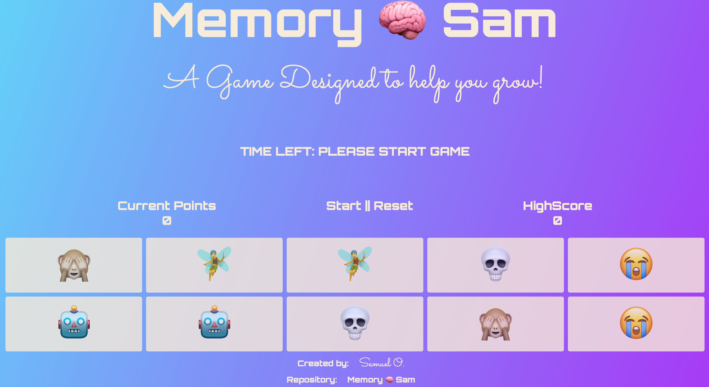

# Memory 🧠 Sam
A Simple javascript game designed to help your brain functionality. Its simple and fun to play. Images in the game are based on Emojis and sorted on each turn so you never get the same order.

### Deployed Link
[Github Pages](https://wsamuell.github.io/memory-sam/)

### User Story
AS A person with free time
I WANT to play a game that is engaging
SO THAT i can stimulate brain my activity

### Screenshot

